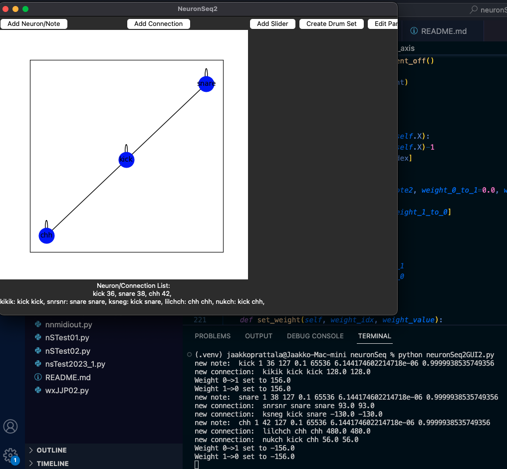

# neuronSeq
A MIDI sequencer based on a real time oscillating neural network

(c) Jaakko Prättälä 2019-2023, use as you wish.

Based on the ideas of motion patterns and the MINN-network in the doctoral thesis of Pauli Laine.

What is neuronSeq?

-- An implementation of a neural network that outputs MIDI data.

-- neuronSeq can be connected to send real time event data to anything that reads MIDI.

-- An exploration of the oscillation/resonance model of music and mind.

-- Whole lot of psychedelic fun.

What is required?

-- Programming language python, libraries rtmidi, tkinter, numpy and matplotlib
Also, a MIDI router or interface and some syntheziser or drum machine, soft or hard.

-- Patience.

What does it do?

-- neuronSeq's NNote objects implement a class that mimic the actions of a nerve cell.
   They fire when a threshold is reached by an ever ascending activation counter. As NNote fires,
   a MIDI event is produced and activation is reset to 0.0.
   NNotes can be connected to other NNotes. Connected NNotes modulate each other's activation value
   via a weighed connection to create simultaneous (positive weight in connection)
   or fluctuating patterns (negative weight in connection). These +/- connections
   are essentially the modes of operation needed to make anything musical.

-- Connection objects in neuronSeq model a neuron to neuron weighed connection.

-- Implements a model of sequencing musical events without a central timer. NNotes are bound to only their activation
   and the activation of their connected NNotes, not to a central clock that would specify tempo, quantization, groove
   and other such variables.

-- neuronSeq is a relatively novel way to use the neural network paradigm. In stead of creating a static
   representation of a pattern, neuronSeq creates a connected set of real time operating oscillators
   (nerve cell simulations). This network could be taught to simulate any musical pattern,
   but then, a learning algorithm is needed. At the moment parameters have to be set manually.

-- It makes noise. Which is nice.
   
Run the gui with
<code>
$ python nsTkGUI3.py
</code>

</img>

